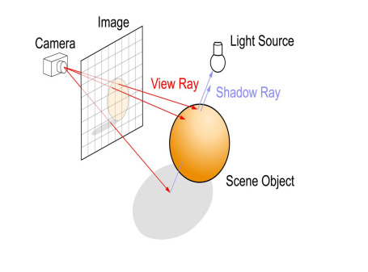
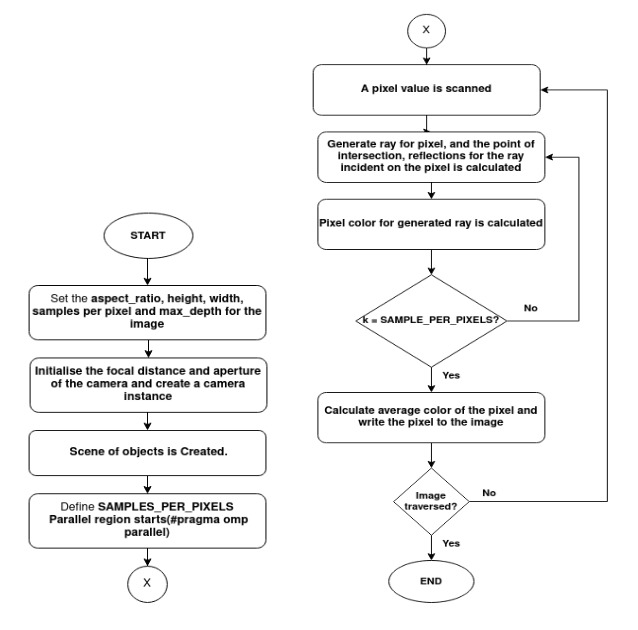
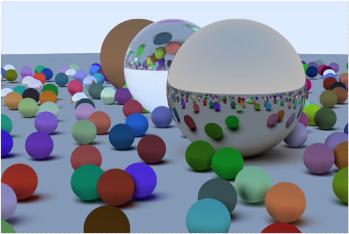
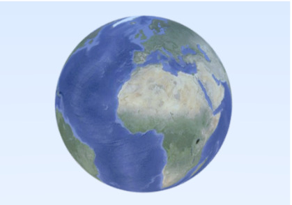
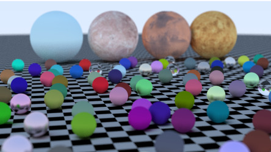
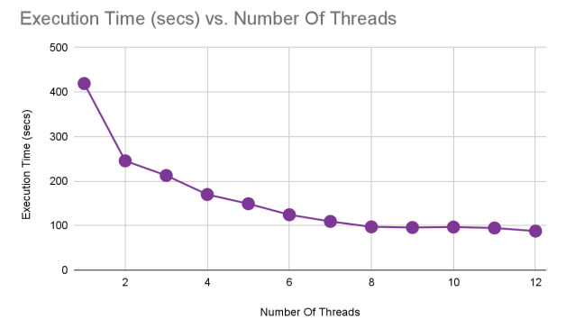
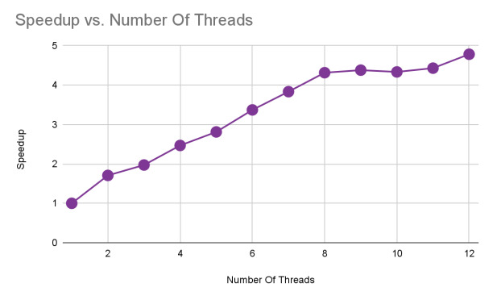
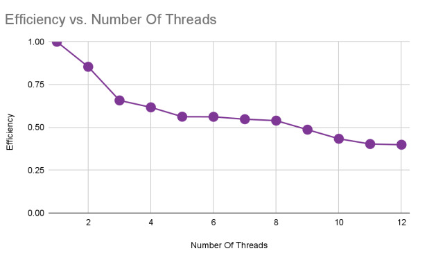

# Parallelization of Ray Tracer

<i>Note: Please star the repo if you find the project useful.</i>

## Introduction

<div style="text-align: justify;">

Ray tracing is a technique for rendering images from a three dimensional model of a scene by projecting it onto a two dimensional image plane. It works by calculating the direction of the ray that strikes each pixel of the image plane, and tracing that ray back into the scene to determine the interaction of lights and surfaces that produced that ray. Ray tracing is preferred over the traditional rasterization techniques of rendering images as there is better handling of shadows, reflections and blurs. Ray tracing is known to be computational intensive and costly when implemented. In this project, our main objective will be to reduce the time of the process while retaining the property of creating photorealistic images. With the current advent of parallel computing, it is possible to do so by using methods such as parallel computing, multiprocessor programming and vector intrinsics.


## Installation
```
mkdir build
cd ./build
conan install ../
cmake --build . --target clean
cmake ../ -G "Unix Makefiles" 
cmake --build .
```

## Problem Formulation

### Brief Description of Idea

<p align="center">
  
</p>

<p align="center">
  Simple Ray Tracer
</p>

Ray Tracing is a technique for modeling light transport to use in a variety of rendering algorithms for generating the digital images.

Due to the high computational cost and visual fidelity mainly in path tracing, it becomes slower and there is higher fidelity. The speed of the ray tracer is really significant due to the rendering of each frame. That is the reason why reducing the time is of significance here. We are going to parallelize the whole path tracing process to reduce the time significantly.

### Flowchart

<p align="center">
  
</p>

<p align="center">
  Flowchart of Ray Tracer Algorithm
</p>

### Use Cases

Some of the applications of ray tracing are discussed below:
- <b>Architectural Rendering</b>: Ray tracing can be used by architects to achieve realistic renderings accompanying their designs. Backwards ray tracing, combined with radiosity
techniques, is suggested to be the most useful method for architectural rendering as even CAD programs which accurately model objects are unable to model light accurately.

- <b>Theater and Television Lighting Design</b>: Stage and television productions require hundreds of individual lights that need to be positioned, aimed, filtered, redirected and
dimmed while a production is actually in progress. Ray tracing allows engineers to develop and visualize complex lighting setups in advance and with relative ease.

- <b>Ray Tracing in Animation</b>: Ray tracing can be used to effects such as advanced reflection, shadowing, and specularity to animations. Graphical technology is also capable of rendering photorealistic images that would be nearly impossible to produce without computerized ray tracing.

- <b>Ray Tracing as a Tool for Engineers</b>:
Ray tracing is capable of considering all of the light in a given environment. This concept of global illumination can be used by lighting designers, solar energy researchers, and mechanical engineers to predict illumination levels, luminance gradients, and visual performance criteria while creating any applications.

- <b>Geophysical modeling and presentation</b>: Seismic tomography is a major research topic on geophysics and concerns the reconstruction of the Earth’s interior. The purpose of seismic modeling is to provide the seismic interpreter with a tool to aid in the interpretation of difficult geological structures. In raypath modeling, ray tracing is carried out for models of multilayered folded structures so as to generate ray diagrams and synthetic time sections. The growing need for fast and accurate prediction of high-frequency wave properties in
complex subterranean structures has spawned the requirement of a ray tracer to compute the trajectory of the path corresponding to wave front normals.

## Methodology

### Implementation
Every Ray Tracer has a ray class and a computation of what color is seen along a ray. A ray can be represented as a function 

<div style="text-align:center">
  <code>P(t) = A + tb </code>
</div> <br>


Here <code>P</code> is a 3D position along a line in 3D, <code>A</code> is ray origin, <code>b</code> is the ray direction and <code>t</code> is the ray parameter. Since C does not have the concept of classes, we used header files(.h files) and an implementation file(.c file).


At the core, the ray tracer sends rays through pixels and computes the color seen in the direction of those rays. The involved steps are:

1.  calculate the ray from the eye to the pixel

2.  determine which objects the ray intersects

3.  compute a color for that intersection point

The recommended aspect ratio for the image is 16:9. In addition to setting up the pixel dimensions for the rendered image, a virtual viewport was also set up through which to pass our scene rays. To remove the aliasing effect(jagged edges in rasterized image), a technique called <b>Antialiasing</b> was used.


In the ray tracer we implemented, one can add multiple objects to a scene each of which may have varied properties(reflective or non reflective). The equation of the sphere in vector form
is: 
<div style="text-align:center">
  <code>(P-C).(P-c) = r^2. </code>
</div> <br>

If our ray <code>P(t) = A + tb</code> ever hits the sphere anywhere. If it does hit the sphere, there is some <code>t</code> for which <code>P(t)</code> satisfies the sphere equation. 

So, we looked for any t where this is true:
<code>(P(t)−C)⋅(P(t)−C)=r^2. </code>

The equation of the sphere is solved with the ray so as to get the "nearest" point of incidence on the scene.


In order to get the shading and reflective effects in the scene, we used the concept of surface normals. In addition, it also helps in identifying the surface where the light is incident (inner or outer). Also, to encompass N number of spheres within the scene we have implemented a list of "hittables" which also had, type of material as a parameter(Lambertian,Metal, Dielectrics and Glass).


For reflective surfaces we have used the laws of reflections for calculating the direction of reflected rays and similarly Snell's law for dielectric services. A number of factors had to be taken into consideration while calculating the resultant direction of the reflected ray like TIR(Total Internal Reflection).

We have implemented many object types like Diffuse objects that don’t emit light merely take on the color of their surroundings, but they modulate that with their own intrinsic color. Light that reflects off a diffuse surface has its direction randomized. So, we had to use random spheres to predict the direction of the reflected ray and the corresponding child rays which could be controlled using the "depth" attribute. 

In order to get different views of the scene, we also implemented a positionable camera. We had to use a thin lens approximation to use defocus blur. The reason we defocus blur in real cameras is because they need a big hole (rather than just a pinhole) to gather light. This would defocus everything, but if we use a lens in the hole, there will be a certain distance where everything is in focus.

### Linear Algebraic Functions Implemented Using SIMD Library

We made separate math linear algebraic functions library for a vector of 3D and 4D to carry out linear algebraic operations necessary for parallel ray tracing in the most efficient way possible.

Same common functions were implemented separately for both 3D and 4D vectors. The parallel mechanism used was OpenMP vectorization often referred to as SIMD (Single Instruction Multiple Data) parallelism. SIMD provides data parallelism at the instruction level where a single instruction operates upon multiple data elements. The best part of SIMD is that the instructions are almost as fast as their scalar counterparts which effectively reduces processor time spent by many folds.

This library primarily made use of only the SIMD loop parallel constructs with some clauses like the reduction clause and schedule clause for a variety of reason which shall be explained below:

#### 1. pragma omp parallel for simd schedule (simd : static)

This directive was used several times when it came to calculation of variables, assigning the values of a vector with other scalar or values of other vectors. Each loop has a certain amount of work associated with it. If the number of threads is increased, the amount of work performed per thread is reduced. Adding SIMD parallelism to this does not necessarily improve the efficiency also especially in the SIMD loops, where each of the threads focusses on reduction in length as and when the thread count increases.

The loop schedule of the work-sharing construct hampers any chance for vectorization. For good performance this must be taken into account. If the static schedule is used with a small chunk size, or if the dynamic, or guided, schedule is used, the SIMD optimal efficiency may not be attained. The reason is that the number of iterations per thread may be too small for SIMD to prove any good to us and moreover the compiler may also fail to generate the most efficient SIMD code due to loop tails and poor memory access patterns.

To address these problems the SIMD schedule modifier was taken into account where it takes care of the problem of the chunk size of a given vector with a definite length. The implementation of a ‘parallel’ construct mixed with ‘for simd’ construct proves to be gamechanger without an issue or problem arising out of load balancing topic and a point to note
is that ‘simd:static’ clause is among those efficient for use.

The above reasons and explanation as well as some literature surveys lead us to implement this directive with schedule clause and a parallel construct especially when iteration is required over a small number. The vectors used are of either 3D or 4D where it involves iteration over three or four of its respective coordinates and this necessity is perfectly met by the above mentioned clauses and work sharing constructs.

#### 2. pragma omp simd reduction (+ : sum)

This directive was helpful in processing functions related to calculating the sum of the vectors and their values. The reduction clause for OpenMP works similarly in the context of the SIMD construct. The reduction clause takes a list of variables and the reduction operator as its arguments. For each variable in the list, a private instance is used during the execution of the SIMD loop. The partial results are accumulated into the private instance. The reduction operator is applied to combine all partial results, such that the final result is returned in the original variable and made available after the SIMD loop.

This function was instrumental in algebraic calculation of dot products of vectors.

## RESULTS

### Rendered Images

<p align="center"></p>

<p align="center">Procedurally Generated Scene</p>

<p align="center">
  
</p>

<p align="center">UV Texture Mapping</p>

<p align="center">
  
</p>

<p align="center">Procedural Scene Generation Using UV Texture Mapping</p>

### Discussion

<p align="center">
  
</p>

<p align="center">Fig. 1. Execution Time vs Number of Threads</p>

<p align="center">
  
</p>

<p align="center">Fig. 2. Speedup vs Number of Threads</p>

<p align="center">
  
</p>

<p align="center">Fig. 3. Efficiency vs Number of Threads</p>

Fig 1, 2 and 3 above are produced by rendering the same image on multiple threads. Fig 1 is the graph of execution time vs the number of threads, we can observe that there is a steep decrease in the execution time when going from a single thread to eight threads. After eight threads the decrease is not noticeable.

In the graph of speedup vs number of threads (Fig 2) we can observe a linear speedup going from one thread to 8 threads and after that the speedup increases slowly. The efficiency (Fig 3)
is around 0.50 for 3 to 8 threads and it decreases to 0.45 when more threads are added. By observing the trends in the above graphs (Fig 1, 2, and 3), we conclude that the number of threads optimal for our application is around 8.

## Conclusion

Ray tracer as an image rendering technique has gained a lot of attention in recent years due to its realistic rendering of shadows and textures. Serial implementation of Ray Tracing
algorithms can take hours to render one scene. To solve this problem , we have proposed and implemented a ray tracing algorithm that makes use of the vector features of SIMD model and
the parallel processing features of OpenMP to reduce the running time of this algorithm. While the serial ray tracing algorithm took -- seconds to execute, the parallel algorithm achieved the
same results in -- seconds. While the serial ray tracing algorithm took 801.42 seconds to execute, the parallel algorithm achieved the same results in 245.60 seconds.Hence we can
conclude that we were successfully able to parallelize a Ray Tracing algorithm.

</div>


